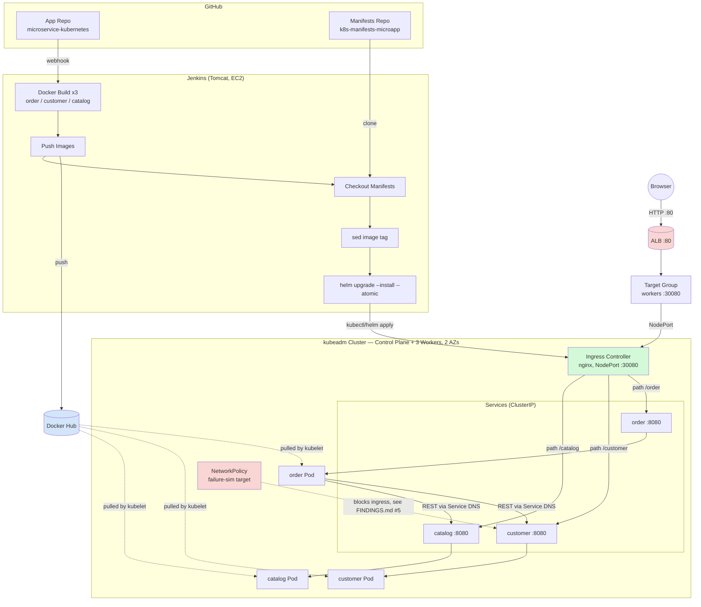

# microservice-kubernetes — Phase 2 App Fork

## Project Summary

**What this is:** Phase 2 of a two-phase DevOps infrastructure portfolio project. Phase 1 deployed a single monolithic Java app to a self-managed Kubernetes cluster with a full CI/CD pipeline and one documented failure simulation. Phase 2 extends the same infrastructure discipline to a **real 3-service microservices application**, specifically to demonstrate failure modes and operational patterns a single-app architecture cannot produce.

**Scope — infrastructure and operations, deliberately not application development.** The application itself is an unmodified fork of [ewolff/microservice-kubernetes](https://github.com/ewolff/microservice-kubernetes); every change in this repository is at the Docker, Kubernetes, CI/CD, or networking layer. This boundary is held even where it would have been easy to cross — see FINDINGS.md for a case where a real bug was found, root-caused, and deliberately left unfixed because the fix belonged in application code.

**What was built, concretely:**
- Terraform-provisioned AWS infrastructure — custom VPC, multi-AZ subnets, security groups, 5 EC2 instances (control plane, 3 spot-instance workers, Jenkins)
- Self-managed Kubernetes cluster via `kubeadm`, with Calico as CNI — chosen specifically for its `NetworkPolicy` enforcement capability, later used in the failure simulation
- A 3-service microservices app (Order, Customer, Catalog) with hand-written multi-stage Docker builds, correctly resolving a Maven multi-module reactor structure the original single-stage Dockerfiles didn't have to handle
- A custom Helm chart templating all 3 services' Deployments, Services, and a shared regex-based Ingress from one `values.yaml`
- A full Jenkins CI/CD pipeline — Docker build/push for all 3 services, then an atomic Helm-based cluster deploy, triggered per commit
- Namespace-scoped RBAC for the CI/CD identity, verified with intentional `Forbidden` checks against the live cluster, not just configured and trusted
- A deliberate, evidence-based inter-service failure simulation — not a hypothetical, an actual `NetworkPolicy` outage with measured recovery time and a documented root-cause chain

**Key outcome:** proved that Phase 1's failure model does not generalize to a distributed system — Kubernetes' built-in self-healing (readiness probes, Service Endpoints) has a real, specific blind spot: a downstream service being unreachable is structurally invisible to a probe that only checks local application health. This only became visible by deliberately breaking the system and measuring what actually happened, not by reasoning about it in the abstract. Full technical narrative, including every real infrastructure bug hit and fixed along the way, is in [FINDINGS.md](./FINDINGS.md).

---

## Architecture Overview



<details>
<summary>Text-based diagram (fallback if Mermaid doesn't render)</summary>

```
GitHub: App Repo ──webhook──▶ Jenkins (Tomcat/EC2)
GitHub: Manifests Repo ──clone──▶ Jenkins

Jenkins: Docker Build (order, customer, catalog)
      ──▶ Push to Docker Hub
      ──▶ sed image tag into values.yaml
      ──▶ helm upgrade --install --atomic

Docker Hub ──pulled by kubelet──▶ 3 pods (order, customer, catalog)

Browser ──HTTP :80──▶ ALB ──▶ Target Group ──NodePort :30080──▶
    Ingress Controller (nginx) ──path-based routing──▶
        /order    ──▶ order Service (ClusterIP)    ──▶ order Pod
        /customer ──▶ customer Service (ClusterIP) ──▶ customer Pod
        /catalog  ──▶ catalog Service (ClusterIP)  ──▶ catalog Pod

order Pod ──REST via Kubernetes Service DNS──▶ customer Service
order Pod ──REST via Kubernetes Service DNS──▶ catalog Service

NetworkPolicy (failure simulation) ──blocks──▶ customer Service ingress
```

</details>

**Key points the diagram makes visible:**
- Two completely separate routing mechanisms are in play: **external** browser traffic goes Browser → ALB → Target Group → NodePort → Ingress Controller → Service → Pod (6 hops); **internal** service-to-service calls (`order` → `customer`/`catalog`) go directly through Kubernetes Service DNS, never touching the ALB or Ingress Controller at all.
- The `NetworkPolicy` used in the failure simulation targets exactly one edge in this graph — `customer`'s Service ingress — leaving `catalog`, `order`, and all external routing completely unaffected, which is what made it possible to isolate the blast radius precisely.
- Manifests are applied by Jenkins via Helm; RBAC (not shown here) and observability infrastructure are applied separately by a cluster-admin identity, never by the CI/CD pipeline itself — see HOW-TO-RUN.md's RBAC section for why.

---

## What changed from upstream, and why

| Removed | Why |
|---|---|
| `microservice-kubernetes-demo/apache/` | Upstream's own reverse-proxy layer for routing between services. Replaced entirely by an ingress-nginx Ingress Controller with path-based routing. |
| `docker-build.sh` | Host-based, single-stage build script (assumed the jar was already built on the host before `docker build` ran). Replaced by proper multi-stage Dockerfiles built and pushed by Jenkins. |
| `kubernetes-deploy.sh`, `kubernetes-remove.sh`, `microservices.yaml` | Upstream's own bare-manifest deploy scripts. Replaced by a Helm chart (in a separate `k8s-manifests-microapp` repo) applied via `helm upgrade --install` from Jenkins. |
| `HOW-TO-RUN.md`, `WIE-LAUFEN.md` | Described the now-removed Apache/bare-manifest workflow. Replaced by this project's own `HOW-TO-RUN.md`. |

| Rewritten | Why |
|---|---|
| Each service's `Dockerfile` | Upstream's Dockerfiles were single-stage, assuming `mvn clean package` had already run on the host (`COPY target/*.jar` with no build step). Rewritten as proper multi-stage builds (Maven build stage → lean JRE runtime stage), matching the pattern already proven in Phase 1's login-app. |

**Not changed:** all Java source, the Maven multi-module reactor structure (parent `pom.xml` + 3 child modules), the embedded HSQL in-memory database, Spring Data REST auto-generated APIs, and the Thymeleaf HTML templates.

---

## Architecture note: the Maven multi-module build

The three services are **not independent projects** — `order`, `customer`, and `catalog` each declare the root `microservice-kubernetes-demo/pom.xml` as their Maven `<parent>`. This means:

- Docker build **context** for each service must be the parent folder (`microservice-kubernetes-demo/`), not the individual service subfolder — otherwise the parent POM can't be resolved.
- Each Dockerfile runs `mvn -N install` first (installing *only* the parent artifact, non-recursively) before building the specific service module.

Full explanation of the build mechanics, line by line, is in [HOW-TO-RUN.md](./HOW-TO-RUN.md#dockerfile--build-logic-explained).

---

## Repository structure

```
microservice-kubernetes-demo/
├── pom.xml                              ← parent POM (aggregation + shared config)
├── microservice-kubernetes-demo-order/
│   ├── Dockerfile                       ← multi-stage, rewritten for this project
│   ├── pom.xml                          ← child, <parent> = root pom.xml
│   └── src/
├── microservice-kubernetes-demo-customer/
│   └── (same structure)
└── microservice-kubernetes-demo-catalog/
    └── (same structure)
```

Terraform config and the Kubernetes manifests (Helm chart) live in separate repositories — kept apart from application source for the same reason Phase 1's manifests repo was separated: independent versioning/review of infra config from app changes.

- Terraform config: https://github.com/s-v-bagade/tf-config-microapp.git 
- Kubernetes manifests / Helm chart: https://github.com/s-v-bagade/k8s-manifests-microapp.git

---

## Related documents

- **[HOW-TO-RUN.md](./HOW-TO-RUN.md)** — deployment steps plus the reasoning behind every major design decision (Dockerfile, Jenkinsfile, Ingress, Helm chart) — written as a study document, not just a command list
- **[FINDINGS.md](./FINDINGS.md)** — structured postmortem of real issues hit and fixed, an inter-service failure simulation with measured results, and a documented list of what's deliberately left unfinished

## Upstream

Original project: [ewolff/microservice-kubernetes](https://github.com/ewolff/microservice-kubernetes), part of Eberhard Wolff's microservices reference implementations. License terms from the upstream repository apply to all unmodified application code in this fork.

